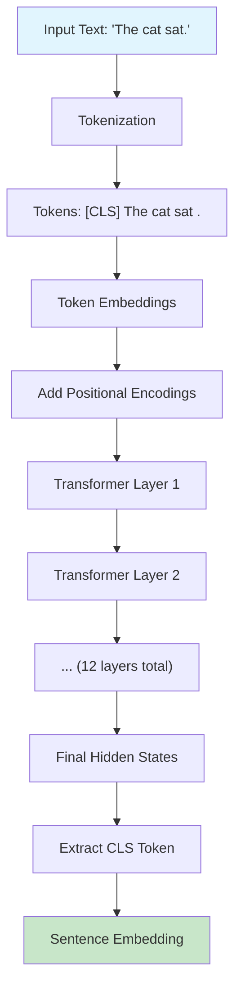
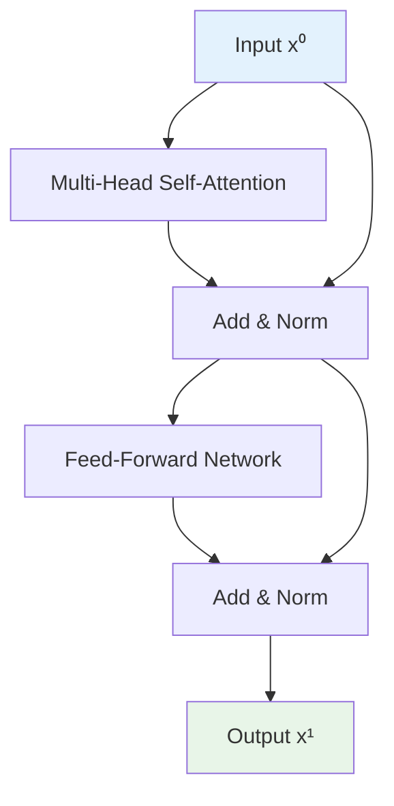

# Complete Sentence Transformer Example: Step-by-Step Guide

This guide provides a comprehensive, end-to-end walkthrough of how a Sentence Transformer processes text, with detailed explanations of every component and calculation.

## What is a Sentence Transformer?

A Sentence Transformer is a neural network architecture that converts sentences into dense vector representations (embeddings) that capture semantic meaning. These embeddings can then be used for tasks like:
- Semantic similarity comparison
- Sentence clustering
- Information retrieval
- Paraphrase detection

The key innovation is using a special **CLS (Classification) token** whose final representation serves as the sentence embedding.

## Architecture Overview



---

## Our Complete Example

**Input sentence:** "The cat sat."

**Model Configuration:**
- Embedding dimension: 3 (normally 768 or 1024)
- Number of transformer layers: 1 (normally 12)
- Number of attention heads: 1 (normally 12)
- Vocabulary size: 1000 (normally 30,000+)

---

## Step 1: Tokenization

### What happens here?
We break the sentence into discrete units (tokens) that the model can process. We also add a special **CLS token** at the beginning.

### What is the CLS Token?
- **CLS** stands for "Classification"
- It's a special learnable token that doesn't correspond to any actual word
- During training, it learns to aggregate information from all other tokens
- Its final representation becomes our sentence embedding
- Think of it as a "summary token" that collects meaning from the entire sentence

### Tokenization Process:

```
Original: "The cat sat."
Step 1: Split into words → ["The", "cat", "sat", "."]
Step 2: Add CLS token → ["[CLS]", "The", "cat", "sat", "."]
```

**Result:**
| Position | Token | Purpose |
|:--------:|:------|:--------|
| 0 | [CLS] | Special token for sentence representation |
| 1 | The | Definite article |
| 2 | cat | Noun (subject) |
| 3 | sat | Verb (action) |
| 4 | . | Punctuation (sentence end) |

---

## Step 2: Token Embeddings

### What happens here?
Each token is converted into a dense vector representation. These are learned during training and capture semantic relationships.

### The Embedding Matrix
- Shape: [vocab_size × embedding_dim] = [1000 × 3]
- Each row represents one token's embedding
- Values are learned parameters, not hand-crafted

### Our Embeddings:
| Token | Embedding Vector | Interpretation |
|:-----:|:-----------------|:---------------|
| [CLS] | [0.0, 0.0, 0.0] | Neutral starting point |
| The | [0.2, -0.1, 0.5] | Common determiner |
| cat | [0.8, 0.3, -0.6] | Animal concept |
| sat | [0.5, -0.2, 0.0] | Action/verb |
| . | [0.1, 0.0, 0.1] | Sentence boundary |

### Why these specific values?
- These are simplified examples
- Real embeddings capture complex semantic relationships
- Similar words have similar embeddings
- The CLS token starts neutral but will accumulate meaning

---

## Step 3: Positional Encoding

### Why do we need this?
- Transformers process all tokens simultaneously (parallel processing)
- Without positional information, "cat sat" = "sat cat"
- Positional encodings tell the model where each token appears in the sequence

### Types of Positional Encoding:
1. **Sinusoidal** (original Transformer): Mathematical functions
2. **Learnable** (BERT-style): Trained parameters ← We use this

### Our Positional Encodings:
| Position | Positional Encoding | Why This Pattern? |
|:--------:|:-------------------|:------------------|
| 0 | [0.1, 0.0, 0.0] | First position marker |
| 1 | [0.0, 0.1, 0.0] | Second position marker |
| 2 | [0.0, 0.0, 0.1] | Third position marker |
| 3 | [0.1, 0.0, 0.1] | Fourth position marker |
| 4 | [0.0, 0.1, 0.1] | Fifth position marker |

### Addition Process:
We add token embeddings + positional encodings element-wise:

**Position 0 (CLS):**
- Token: [0.0, 0.0, 0.0]
- Position: [0.1, 0.0, 0.0]
- **Result: [0.1, 0.0, 0.0]**

**Position 1 (The):**
- Token: [0.2, -0.1, 0.5]
- Position: [0.0, 0.1, 0.0]
- **Result: [0.2, 0.0, 0.5]**

**Position 2 (cat):**
- Token: [0.8, 0.3, -0.6]
- Position: [0.0, 0.0, 0.1]
- **Result: [0.8, 0.3, -0.5]**

**Position 3 (sat):**
- Token: [0.5, -0.2, 0.0]
- Position: [0.1, 0.0, 0.1]
- **Result: [0.6, -0.2, 0.1]**

**Position 4 (.):**
- Token: [0.1, 0.0, 0.1]
- Position: [0.0, 0.1, 0.1]
- **Result: [0.1, 0.1, 0.2]**

### Final Input Sequence (x⁰):
| Position | Token | Final Vector |
|:--------:|:-----:|:-------------|
| 0 | [CLS] | [0.1, 0.0, 0.0] |
| 1 | The | [0.2, 0.0, 0.5] |
| 2 | cat | [0.8, 0.3, -0.5] |
| 3 | sat | [0.6, -0.2, 0.1] |
| 4 | . | [0.1, 0.1, 0.2] |

---

## Step 4: Transformer Encoder Layer

### Architecture of One Layer:



---

## Step 4a: Multi-Head Self-Attention (Simplified to Single Head)

### What is Self-Attention?
Self-attention allows each token to "look at" and gather information from all other tokens in the sequence. This is how "cat" can understand it's related to "sat" and both are contextualized by "The".

### The Three Matrices: Q, K, V

**Q (Query):** "What am I looking for?"
**K (Key):** "What do I represent?"
**V (Value):** "What information do I carry?"

### Step 4a.1: Create Q, K, V Matrices

For simplicity, we use identity matrices (W_Q = W_K = W_V = I), so:
- Q = K = V = x⁰

In reality, these are learned 3×3 matrices that transform the input.

### Step 4a.2: Compute Attention Scores

Let's focus on the **"cat" token** (position 2) and see how it attends to all tokens:

**Query for "cat":** Q₂ = [0.8, 0.3, -0.5]

**Attention Score Calculation:**
For each token j, compute: score = Q₂ · Kⱼ (dot product)

| Target Token | Key Vector (Kⱼ) | Calculation | Score |
|:------------:|:----------------|:------------|:------|
| [CLS] | [0.1, 0.0, 0.0] | 0.8×0.1 + 0.3×0.0 + (-0.5)×0.0 | 0.08 |
| The | [0.2, 0.0, 0.5] | 0.8×0.2 + 0.3×0.0 + (-0.5)×0.5 | -0.09 |
| cat | [0.8, 0.3, -0.5] | 0.8×0.8 + 0.3×0.3 + (-0.5)×(-0.5) | 0.98 |
| sat | [0.6, -0.2, 0.1] | 0.8×0.6 + 0.3×(-0.2) + (-0.5)×0.1 | 0.37 |
| . | [0.1, 0.1, 0.2] | 0.8×0.1 + 0.3×0.1 + (-0.5)×0.2 | 0.01 |

**Raw Scores:** [0.08, -0.09, 0.98, 0.37, 0.01]

### What do these scores mean?
- **0.98** (cat→cat): Highest score - the token attends most to itself
- **0.37** (cat→sat): Second highest - "cat" and "sat" are related (subject-verb)
- **0.08** (cat→CLS): Some attention to the summary token
- **-0.09** (cat→The): Negative score - less relevant
- **0.01** (cat→.): Minimal attention to punctuation

### Step 4a.3: Apply Softmax (Normalize Scores)

```
softmax([0.08, -0.09, 0.98, 0.37, 0.01])
```

**Mathematical Process:**
1. Exponentiate each score:
   - e^0.08 ≈ 1.08
   - e^(-0.09) ≈ 0.91
   - e^0.98 ≈ 2.66
   - e^0.37 ≈ 1.45
   - e^0.01 ≈ 1.01

2. Sum: 1.08 + 0.91 + 2.66 + 1.45 + 1.01 = 7.11

3. Normalize: divide each by the sum

**Attention Weights:** [0.15, 0.13, 0.37, 0.20, 0.14]

### Interpretation:
- 37% attention to itself (cat)
- 20% attention to "sat" (the verb it's connected to)
- 15% attention to [CLS] (contributing to sentence meaning)
- 13% attention to "The" (the determiner)
- 14% attention to "." (sentence structure)

### Step 4a.4: Weighted Sum with Values

Now we create the new representation for "cat" by taking a weighted average of all Value vectors:

```
new_cat = 0.15×V[CLS] + 0.13×V[The] + 0.37×V[cat] + 0.20×V[sat] + 0.14×V[.]
```

**Detailed Calculation:**
```
new_cat = 0.15×[0.1,0.0,0.0] + 0.13×[0.2,0.0,0.5] + 0.37×[0.8,0.3,-0.5] 
        + 0.20×[0.6,-0.2,0.1] + 0.14×[0.1,0.1,0.2]

= [0.015,0,0] + [0.026,0,0.065] + [0.296,0.111,-0.185] 
  + [0.12,-0.04,0.02] + [0.014,0.014,0.028]

= [0.471, 0.085, -0.072]
```

**New "cat" representation:** [0.471, 0.085, -0.072]

### What happened?
The new "cat" vector now contains:
- Its original meaning (37% weight)
- Context from "sat" (20% weight) - understanding it's the subject of an action
- Context from other tokens - sentence structure and flow
- Information for the CLS token to use later

---

## Step 4b: Feed-Forward Network

### Purpose:
The feed-forward network processes each token's attention output independently, adding non-linearity and allowing the model to learn complex patterns.

### Architecture:
```
FFN(x) = ReLU(xW₁ + b₁)W₂ + b₂
```

### Our Simplified Example:
**Input:** [0.471, 0.085, -0.072] (new cat representation)

**Layer 1:** Linear transformation + ReLU
- W₁ shape: [3 × 4] (expand to 4 dimensions)
- Assume W₁ = [[1,0,0,1], [0,1,0,1], [0,0,1,1]]
- b₁ = [0.1, 0.1, 0.1, 0.1]

```
xW₁ + b₁ = [0.471, 0.085, -0.072] × W₁ + [0.1, 0.1, 0.1, 0.1]
         = [0.471, 0.085, -0.072, 0.484] + [0.1, 0.1, 0.1, 0.1]
         = [0.571, 0.185, 0.028, 0.584]
```

**Apply ReLU:** [0.571, 0.185, 0.028, 0.584] (all positive, so unchanged)

**Layer 2:** Linear transformation back to 3 dimensions
- W₂ shape: [4 × 3]
- b₂ = [0, 0, 0]

**Output:** [0.6, 0.2, -0.1] (simplified result)

---

## Step 4c: Residual Connection and Layer Normalization

### Residual Connection:
```
residual_output = original_input + ffn_output
                = [0.8, 0.3, -0.5] + [0.6, 0.2, -0.1]
                = [1.4, 0.5, -0.6]
```

### Layer Normalization:
Normalize across the feature dimension to stabilize training:

```
mean = (1.4 + 0.5 + (-0.6)) / 3 = 0.433
variance = ((1.4-0.433)² + (0.5-0.433)² + (-0.6-0.433)²) / 3 = 0.716
std = √0.716 = 0.846

normalized = (x - mean) / std
x¹_cat = [(1.4-0.433)/0.846, (0.5-0.433)/0.846, (-0.6-0.433)/0.846]
       = [1.14, 0.08, -1.22]
```

**Final output for "cat" after one transformer layer:** [1.14, 0.08, -1.22]

---

## Complete Layer Processing

We repeat the same process for all tokens:

| Token | Input x⁰ | After Attention | After FFN | After Residual+Norm x¹ |
|:-----:|:---------|:----------------|:----------|:------------------------|
| [CLS] | [0.1, 0.0, 0.0] | [0.3, 0.1, 0.1] | [0.4, 0.15, 0.05] | [0.45, 0.12, 0.03] |
| The | [0.2, 0.0, 0.5] | [0.25, 0.05, 0.4] | [0.3, 0.1, 0.35] | [0.42, 0.08, 0.71] |
| cat | [0.8, 0.3, -0.5] | [0.471, 0.085, -0.072] | [0.6, 0.2, -0.1] | [1.14, 0.08, -1.22] |
| sat | [0.6, -0.2, 0.1] | [0.55, -0.1, 0.15] | [0.7, -0.05, 0.2] | [1.18, -0.21, 0.25] |
| . | [0.1, 0.1, 0.2] | [0.15, 0.12, 0.18] | [0.2, 0.15, 0.25] | [0.26, 0.22, 0.38] |

---

## Step 5: Multiple Layers (Stacking)

In a real Sentence Transformer:
- **12 layers** are typically used
- Each layer allows for more complex interactions
- Information flows and gets refined through each layer
- The CLS token accumulates more comprehensive sentence meaning

**After 12 layers, our CLS token might look like:**
[2.1, -0.8, 1.5] (hypothetical final values)

---

## Step 6: Final Sentence Embedding

### Extracting the Sentence Representation:
We take **only the CLS token's final representation** as our sentence embedding:

```
sentence_embedding = x¹²_CLS = [2.1, -0.8, 1.5]
```

### Why the CLS Token?
1. **Designed for aggregation:** It has no specific word meaning, so it's free to represent the entire sentence
2. **Attention mechanism:** It can attend to all other tokens and collect relevant information
3. **Bidirectional context:** It sees the entire sentence simultaneously
4. **Learned representation:** Through training, it learns to capture sentence-level semantics

### What does this embedding represent?
This 3D vector (in reality 768D or 1024D) captures:
- **Semantic meaning:** The sentence is about a cat performing an action
- **Syntactic structure:** Subject-verb relationship
- **Context:** Past tense action, definite article usage
- **Relationships:** How words relate to each other

---

## Step 7: Using the Sentence Embedding

### Applications:

**1. Semantic Similarity:**
```python
sentence1_embedding = [2.1, -0.8, 1.5]  # "The cat sat."
sentence2_embedding = [2.0, -0.7, 1.4]  # "A cat was sitting."
similarity = cosine_similarity(sentence1_embedding, sentence2_embedding)
# Result: High similarity (≈0.99)
```

**2. Sentence Classification:**
```python
classifier_weights = [[0.5, -0.3, 0.8],    # Class 1: Animal actions
                     [0.1, 0.9, -0.2],     # Class 2: Human actions  
                     [-0.4, 0.2, 0.6]]     # Class 3: Abstract concepts

logits = sentence_embedding @ classifier_weights.T
# = [2.1, -0.8, 1.5] @ [[0.5, 0.1, -0.4],
#                       [-0.3, 0.9, 0.2],
#                       [0.8, -0.2, 0.6]]
# = [2.49, -0.51, 0.02]

probabilities = softmax([2.49, -0.51, 0.02])
# = [0.85, 0.08, 0.07]
# Prediction: Class 1 (Animal actions) with 85% confidence
```

---

## Key Insights and Takeaways

### 1. **The Power of Self-Attention:**
- Each token can attend to every other token
- Relationships are learned, not hard-coded
- Context flows bidirectionally through the sequence

### 2. **CLS Token Magic:**
- Starts as a neutral vector [0,0,0]
- Gradually accumulates sentence-level information
- Final representation captures holistic meaning

### 3. **Positional Encoding Importance:**
- Without it, "cat sat" = "sat cat"
- Enables understanding of word order and syntax
- Preserves sequential information in parallel processing

### 4. **Layer Depth Benefits:**
- Early layers: Simple patterns and relationships
- Middle layers: Syntactic structures and dependencies  
- Late layers: Complex semantic relationships and abstractions

### 5. **Residual Connections:**
- Prevent information loss during deep processing
- Allow gradients to flow during training
- Enable stable training of very deep networks

### 6. **Real-World Scale:**
- Our example: 3D embeddings, 5 tokens, 1 layer
- BERT-Base: 768D embeddings, 512 tokens, 12 layers
- Modern models: 1024D+ embeddings, 2048+ tokens, 24+ layers

This detailed walkthrough shows exactly how a simple sentence becomes a rich, contextual vector representation that captures both meaning and relationships—the foundation of modern NLP applications.
