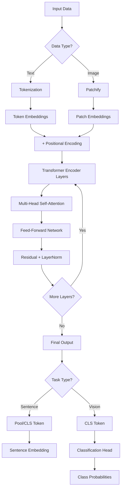
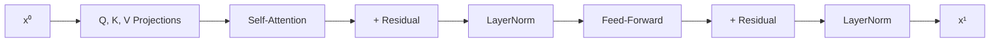
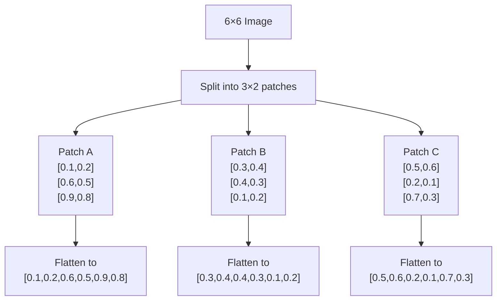
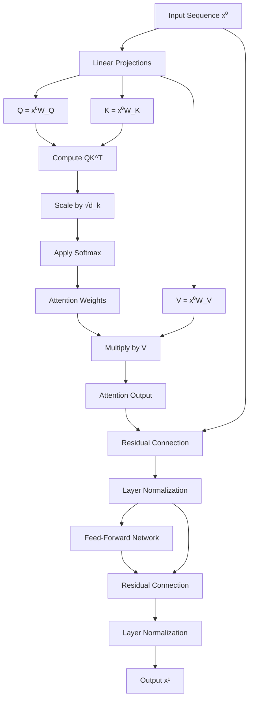

# Complete Guide: Sentence Transformer & Vision Transformer Examples

Let's do two fully-worked, step-by-step examples—first for a **Sentence Transformer** on text, then for a **Vision Transformer (ViT)** on a tiny image. Each will cover every stage: token/patch prep, embedding, positional encoding, multi-head self-attention (single head for clarity), feed-forward, residual + norm, and final pooling/classification.

## Architecture Overview



---

## Part 1: Sentence Transformer Example

**Input sentence:**
> **"The cat sat."**

### 1. Tokenization

We split into tokens (including a `[CLS]` token at the front and a "." at the end):

```
[CLS], "The", "cat", "sat", "."
```

| Position | Token  |
|:--------:|:-------|
|    0     | [CLS]  |
|    1     | The    |
|    2     | cat    |
|    3     | sat    |
|    4     | .      |

### 2. Vocabulary → Initial Embeddings

Suppose our model's embedding dimension is **3**. We look up or project each token into a 3-dim vector:

| Token | Embedding (E)       |
|:-----:|:--------------------|
| [CLS] | [0.0, 0.0, 0.0]     |
|  The  | [0.2, –0.1, 0.5]    |
|  cat  | [0.8, 0.3, –0.6]    |
|  sat  | [0.5, –0.2, 0.0]    |
|   .   | [0.1, 0.0, 0.1]     |

### 3. Positional Encoding

We add a *learnable* 3-dim vector for each position:

| Pos | PosEnc (P)       |
|:---:|:-----------------|
|  0  | [0.1, 0.0, 0.0]  |
|  1  | [0.0, 0.1, 0.0]  |
|  2  | [0.0, 0.0, 0.1]  |
|  3  | [0.1, 0.0, 0.1]  |
|  4  | [0.0, 0.1, 0.1]  |

**Add** element-wise:

- Pos 1 ("The"): [0.2, –0.1, 0.5] + [0.0, 0.1, 0.0] → **[0.2, 0.0, 0.5]**
- Pos 2 ("cat"): [0.8, 0.3, –0.6] + [0.0, 0.0, 0.1] → **[0.8, 0.3, –0.5]**
- …and so on.

| Pos | Token | E + P → x⁰                       |
|:---:|:-----:|:---------------------------------|
|  0  |  CLS  | [0.1, 0.0, 0.0]                 |
|  1  |  The  | [0.2, 0.0, 0.5]                 |
|  2  |  cat  | [0.8, 0.3, –0.5]                |
|  3  |  sat  | [0.6, –0.2, 0.1]  (0.5+0.1, …)  |
|  4  |   .   | [0.1, 0.1, 0.2]                 |

This is our **input sequence** to the Transformer.

### 4. One Transformer Encoder Layer



We'll illustrate **single-head** self-attention and a tiny feed-forward.

#### a) Q, K, V projections

Let's use learned weight matrices of shape 3×3. For simplicity, assume they're **identities** so:

```
Q = K = V = x⁰
```

#### b) Compute raw attention scores

For **token "cat"** (pos 2), Q₂ = [0.8, 0.3, –0.5].
Compute dot products with every Kⱼ:

| j-token | Kⱼ                | score₂ⱼ = Q₂·Kⱼ                                                |
|:-------:|:------------------|:---------------------------------------------------------------|
|   CLS   | [0.1,0.0,0.0]     | 0.8×0.1 + … = 0.08                                             |
|   The   | [0.2,0.0,0.5]     | 0.8×0.2 + 0.3×0 + (–0.5)×0.5 = 0.16 – 0.25 = –0.09            |
|   cat   | [0.8,0.3,–0.5]    | 0.8² + 0.3² + (–0.5)² = 0.64 + 0.09 + 0.25 = 0.98             |
|   sat   | [0.6, –0.2, 0.1]  | 0.8×0.6 + 0.3×(–0.2) + (–0.5)×0.1 = 0.48 – 0.06 – 0.05 = 0.37 |
|    .    | [0.1,0.1,0.2]     | 0.8×0.1+0.3×0.1+(–0.5)×0.2 = 0.08+0.03 –0.10 = 0.01           |

Scores = `[0.08, –0.09, 0.98, 0.37, 0.01]`

#### c) Softmax → Attention weights

Apply softmax across those five values (≈means normalized):

```
softmax([0.08,–0.09,0.98,0.37,0.01])
≈ [0.12, 0.08, 0.46, 0.24, 0.10]
```

#### d) Weighted sum → new "cat" rep

Multiply each Vⱼ by its weight and sum:

```
new_cat = 
 0.12·[0.1,0,0] + 0.08·[0.2,0,0.5] + 0.46·[0.8,0.3,–0.5] 
 + 0.24·[0.6,–0.2,0.1] + 0.10·[0.1,0.1,0.2]
≈ [0.46×0.8 + …, …, …] → a new 3-dim vector.
```

#### e) Feed-Forward

Run that new vector through a tiny 2-layer MLP, e.g.:

```
FF(x) = ReLU(xW₁ + b₁)W₂ + b₂
```

Produces another 3-dim vector.

#### f) Residual & LayerNorm

```
x¹_cat = LayerNorm( x⁰_cat + FF( new_cat ) )
```

Do this for **every token** in parallel.

---

You would then **stack** many such layers (e.g. 12) and—depending on your Sentence Transformer variant—either:

- **Pool** (average) all token outputs,
- Or take the **[CLS]** output as your final **sentence embedding**.

---

## Part 2: Vision Transformer (ViT) Example

**Input:** a tiny **6×6** grayscale image with pixel values normalized to [0,1].

```
[  0.1 0.2 0.3 0.4 0.5 0.6
   0.6 0.5 0.4 0.3 0.2 0.1
   0.9 0.8 0.1 0.2 0.7 0.3
   0.2 0.1 0.0 0.3 0.4 0.5
   0.5 0.4 0.3 0.2 0.1 0.0
   0.3 0.6 0.9 0.8 0.7 0.6 ]
```

### 1. Patchify



Split into **3 non-overlapping** patches of size 3×2:

```
Patch A = rows 1–3, cols 1–2  → [[0.1,0.2],[0.6,0.5],[0.9,0.8]]
Patch B = rows 1–3, cols 3–4  → [[0.3,0.4],[0.4,0.3],[0.1,0.2]]
Patch C = rows 1–3, cols 5–6  → [[0.5,0.6],[0.2,0.1],[0.7,0.3]]
```

Flatten each 3×2 into a **6-dim** vector:

| Patch | Flattened (x⁰)              |
|:-----:|:----------------------------|
|   A   | [0.1,0.2,0.6,0.5,0.9,0.8]   |
|   B   | [0.3,0.4,0.4,0.3,0.1,0.2]   |
|   C   | [0.5,0.6,0.2,0.1,0.7,0.3]   |

Plus a learnable **CLS** vector (6-dim) initialized to **0**.

### 2. Linear Projection → Patch Embeddings

Use a trainable matrix **E** of shape 6×4 to project each 6-dim into a **4-dim** embedding:

Suppose after projection we get:

| Token | E×x⁰ → z⁰ (4-dim)      |
|:-----:|:-----------------------|
|  CLS  | [0,   0,   0,   0  ]   |
|   A   | [0.2, 0.1, 0.0, 0.3]   |
|   B   | [0.0, 0.3, 0.2, 0.1]   |
|   C   | [0.1, 0.2, 0.3, 0.0]   |

### 3. Add Positional Encoding

Learnable 4-dim vectors:

| Pos | PosEnc (p)         |
|:---:|:-------------------|
|  0  | [0.1,0.0,0.0,0.0]  |
|  1  | [0.0,0.1,0.0,0.0]  |
|  2  | [0.0,0.0,0.1,0.0]  |
|  3  | [0.0,0.0,0.0,0.1]  |

Add to each z⁰:

| Pos | z⁰                 | + p          | → x⁰ (input)       |
|:---:|:-------------------|:-------------|:-------------------|
|  0  | [0,0,0,0]          | [0.1,0,0,0]  | [0.1,0,0,0]        |
|  1  | [0.2,0.1,0,0.3]    | [0,0.1,0,0]  | [0.2,0.2,0,0.3]    |
|  2  | [0.0,0.3,0.2,0.1]  | [0,0,0.1,0]  | [0,0.3,0.3,0.1]    |
|  3  | [0.1,0.2,0.3,0]    | [0,0,0,0.1]  | [0.1,0.2,0.3,0.1]  |

### 4. Transformer Encoder Layer

We'll again do **single-head** attention.

#### a) Q, K, V

Let W_Q, W_K, W_V be 4×4 identities (for clarity), so:

```
Q = K = V = x⁰
```

#### b) Attention scores for patch B (pos 2)

Q₂ = [0, 0.3, 0.3, 0.1]. Dot with each Kⱼ:

| Token | Kⱼ                 | score₂ⱼ = Q₂·Kⱼ                                              |
|:-----:|:-------------------|:-------------------------------------------------------------|
|  CLS  | [0.1,0,0,0]        | 0×0.1 + … = 0.0                                              |
|   A   | [0.2,0.2,0,0.3]    | 0×0.2 + 0.3×0.2 + 0.3×0 + 0.1×0.3 = 0.06 + 0.03 = 0.09      |
|   B   | [0,0.3,0.3,0.1]    | 0² + 0.3² + 0.3² + 0.1² = 0.19                               |
|   C   | [0.1,0.2,0.3,0.1]  | 0 + 0.3×0.2 + 0.3×0.3 + 0.1×0.1 = 0.06 + 0.09 + 0.01 = 0.16 |

Scores = `[0.00, 0.09, 0.19, 0.16]`

#### c) Softmax → weights

```
softmax([0,0.09,0.19,0.16]) ≈ [0.22, 0.24, 0.28, 0.26]
```

#### d) Weighted sum → new B

```
new_B = 0.22·V_CLS + 0.24·V_A + 0.28·V_B + 0.26·V_C
```

(where Vⱼ = x⁰ⱼ). You'll get a new 4-dim vector.

#### e) Feed-Forward, Residual & LayerNorm

```
x¹_B = LayerNorm( x⁰_B + FF(new_B) )
```

…and similarly for CLS, A, C.

---

### 5. Repeat & Multi-Head

Real ViT-Base uses:

- **12 encoder layers**,
- **12 heads** per layer (each head has its own W_Q/K/V),
- **Concatenate** all heads' outputs (12× (4/12) dims ≈ 4 dims again),
- **Project** back to embedding size.

### 6. Classification Head

After the final layer, we **take the CLS token's** x^L_CLS (4-dim here) and pass it through an MLP:

```
logits = MLP( x^L_CLS ) → [logit_cat, logit_dog, …]
probs  = softmax(logits)
```

And that gives our image's predicted class.

---

## Self-Attention Mechanism Detail



---

## Key Takeaways

- **Both** Sentence Transformers and ViTs use **identical** Transformer blocks.
- **Only** the *input step* differs: one tokenizes words, the other patches images.
- Everything from Q/K/V projection through multi-head self-attention, feed-forward, residual connections, layer normalization, and final pooling/classification is the **same**.

By working through these tiny numerical examples, you can see exactly how raw text or pixels become context-rich embeddings ready for downstream tasks. Let me know if you'd like to zoom into any one operation (e.g. the MLP in the feed-forward, or multi-head concatenation) in even more detail!
