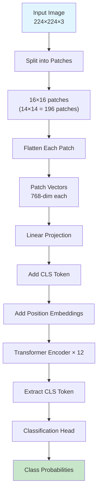
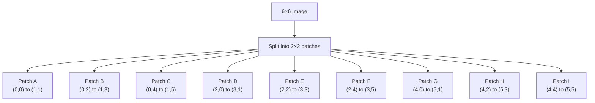
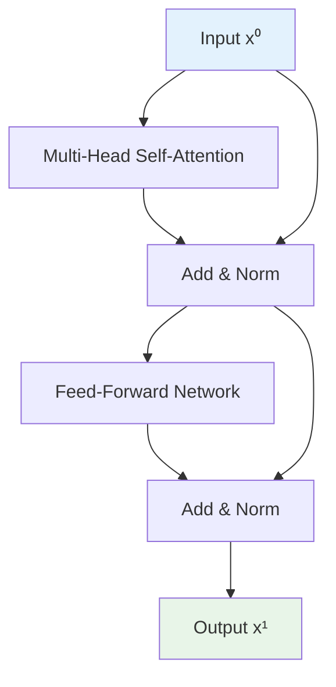
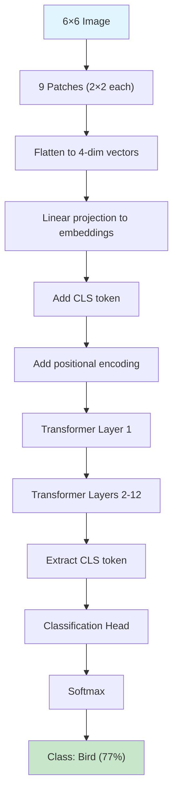

# Complete Vision Transformer (ViT) Example: Step-by-Step Guide

This guide provides a comprehensive, end-to-end walkthrough of how a Vision Transformer processes images, with detailed explanations of every component and calculation.

## What is a Vision Transformer (ViT)?

A Vision Transformer treats images like sequences of patches, similar to how language models treat sentences as sequences of words. The key innovation is:
- **Split image into patches** (like words in a sentence)
- **Flatten patches into vectors** (like word embeddings)
- **Add positional information** (where each patch is located)
- **Use transformer architecture** (identical to text transformers)
- **CLS token for classification** (image-level prediction)

## Architecture Overview



---

## Our Complete Example

**Input:** A tiny **6×6 grayscale image** (normally 224×224×3 RGB)
**Model Configuration:**
- Patch size: 2×2 (normally 16×16)
- Embedding dimension: 4 (normally 768)
- Number of patches: 9 (normally 196)
- Number of transformer layers: 1 (normally 12)
- Number of classes: 3 (cat, dog, bird)

### Our Input Image:
```
Pixel intensities (0.0 = black, 1.0 = white):

   Col: 1   2   3   4   5   6
Row 1: 0.1 0.2 0.3 0.4 0.5 0.6
Row 2: 0.6 0.5 0.4 0.3 0.2 0.1
Row 3: 0.9 0.8 0.1 0.2 0.7 0.3
Row 4: 0.2 0.1 0.0 0.3 0.4 0.5
Row 5: 0.5 0.4 0.3 0.2 0.1 0.0
Row 6: 0.3 0.6 0.9 0.8 0.7 0.6
```

**Visual representation:**
```
██▓▓▒▒░░░░▒▒  (Row 1: bright to dim)
▒▒░░▓▓▒▒░░██  (Row 2: dim to bright)
██▓▓░░▒▒░░▒▒  (Row 3: mixed pattern)
▒▒░░██▒▒▓▓░░  (Row 4: dark center)
░░▓▓▒▒▒▒░░██  (Row 5: varied)
▒▒▒▒██▓▓░░▒▒  (Row 6: bright center)
```

---

## Step 1: Image Patchification

### Why Patches?
- **Computational efficiency:** Processing entire images pixel-by-pixel is computationally expensive
- **Sequence analogy:** Patches are like "words" in an image "sentence"
- **Spatial relationships:** Each patch captures local spatial information
- **Scalability:** Same architecture works for different image sizes

### Patch Creation Process

We divide our 6×6 image into **2×2 non-overlapping patches**:



### Detailed Patch Extraction:

**Patch A (Top-Left):**
```
Coordinates: (0,0) to (1,1)
Values: [0.1, 0.2]
        [0.6, 0.5]
```

**Patch B (Top-Center):**
```
Coordinates: (0,2) to (1,3)
Values: [0.3, 0.4]
        [0.4, 0.3]
```

**Patch C (Top-Right):**
```
Coordinates: (0,4) to (1,5)
Values: [0.5, 0.6]
        [0.2, 0.1]
```

**Patch D (Middle-Left):**
```
Coordinates: (2,0) to (3,1)
Values: [0.9, 0.8]
        [0.2, 0.1]
```

**Patch E (Middle-Center):**
```
Coordinates: (2,2) to (3,3)
Values: [0.1, 0.2]
        [0.0, 0.3]
```

**Patch F (Middle-Right):**
```
Coordinates: (2,4) to (3,5)
Values: [0.7, 0.3]
        [0.4, 0.5]
```

**Patch G (Bottom-Left):**
```
Coordinates: (4,0) to (5,1)
Values: [0.5, 0.4]
        [0.3, 0.6]
```

**Patch H (Bottom-Center):**
```
Coordinates: (4,2) to (5,3)
Values: [0.3, 0.2]
        [0.9, 0.8]
```

**Patch I (Bottom-Right):**
```
Coordinates: (4,4) to (5,5)
Values: [0.1, 0.0]
        [0.7, 0.6]
```

### Patch Grid Layout:
```
+-------+-------+-------+
|   A   |   B   |   C   |
| 0.1,0.2| 0.3,0.4| 0.5,0.6|
| 0.6,0.5| 0.4,0.3| 0.2,0.1|
+-------+-------+-------+
|   D   |   E   |   F   |
| 0.9,0.8| 0.1,0.2| 0.7,0.3|
| 0.2,0.1| 0.0,0.3| 0.4,0.5|
+-------+-------+-------+
|   G   |   H   |   I   |
| 0.5,0.4| 0.3,0.2| 0.1,0.0|
| 0.3,0.6| 0.9,0.8| 0.7,0.6|
+-------+-------+-------+
```

---

## Step 2: Patch Flattening

### Why Flatten?
- Transformers work with 1D sequences, not 2D patches
- Each patch becomes a single vector (like a word embedding)
- Preserves all pixel information while making it sequence-compatible

### Flattening Process:
Each 2×2 patch becomes a 4-dimensional vector by reading left-to-right, top-to-bottom:

| Patch | 2D Structure | Flattened Vector | Interpretation |
|:-----:|:-------------|:-----------------|:---------------|
| A | [[0.1,0.2],[0.6,0.5]] | [0.1, 0.2, 0.6, 0.5] | Moderate brightness, top-left |
| B | [[0.3,0.4],[0.4,0.3]] | [0.3, 0.4, 0.4, 0.3] | Uniform moderate values |
| C | [[0.5,0.6],[0.2,0.1]] | [0.5, 0.6, 0.2, 0.1] | Bright top, dim bottom |
| D | [[0.9,0.8],[0.2,0.1]] | [0.9, 0.8, 0.2, 0.1] | Very bright top, dim bottom |
| E | [[0.1,0.2],[0.0,0.3]] | [0.1, 0.2, 0.0, 0.3] | Mixed with very dark pixel |
| F | [[0.7,0.3],[0.4,0.5]] | [0.7, 0.3, 0.4, 0.5] | Bright start, moderate end |
| G | [[0.5,0.4],[0.3,0.6]] | [0.5, 0.4, 0.3, 0.6] | Decreasing then increasing |
| H | [[0.3,0.2],[0.9,0.8]] | [0.3, 0.2, 0.9, 0.8] | Dim top, very bright bottom |
| I | [[0.1,0.0],[0.7,0.6]] | [0.1, 0.0, 0.7, 0.6] | Very dark top, bright bottom |

### What Each Vector Represents:
- **Patch A:** Top-left corner with gradual brightness increase
- **Patch E:** Center patch with darkest pixel (0.0) - might be important feature
- **Patch H:** Has highest contrast (0.2 to 0.9) - edge or boundary

---

## Step 3: Linear Projection (Patch Embeddings)

### Purpose:
- Transform raw pixel values into learned feature representations
- Project from patch dimension (4) to model dimension (4 in our case, 768 in practice)
- Allow the model to learn what visual features are important

### The Projection Matrix:
**Shape:** [patch_dim × embedding_dim] = [4 × 4]

**Our Example Matrix E:**
```
E = [[0.2, 0.1, 0.0, -0.1],
     [0.0, 0.3, 0.2,  0.1],
     [0.1, 0.0, 0.4,  0.2],
     [0.3, 0.2, 0.1,  0.0]]
```

### Projection Calculation:
For each flattened patch vector, compute: **projected_patch = patch_vector × E**

**Patch A Projection:**
```
[0.1, 0.2, 0.6, 0.5] × E = 
[0.1×0.2 + 0.2×0.0 + 0.6×0.1 + 0.5×0.3,
 0.1×0.1 + 0.2×0.3 + 0.6×0.0 + 0.5×0.2,
 0.1×0.0 + 0.2×0.2 + 0.6×0.4 + 0.5×0.1,
 0.1×(-0.1) + 0.2×0.1 + 0.6×0.2 + 0.5×0.0]

= [0.02 + 0.0 + 0.06 + 0.15,
   0.01 + 0.06 + 0.0 + 0.1,
   0.0 + 0.04 + 0.24 + 0.05,
   -0.01 + 0.02 + 0.12 + 0.0]

= [0.23, 0.17, 0.33, 0.13]
```

### Complete Projection Results:

| Patch | Input Vector | Projected Embedding | Key Features |
|:-----:|:-------------|:-------------------|:-------------|
| A | [0.1, 0.2, 0.6, 0.5] | [0.23, 0.17, 0.33, 0.13] | Moderate activation |
| B | [0.3, 0.4, 0.4, 0.3] | [0.24, 0.22, 0.32, 0.08] | Balanced features |
| C | [0.5, 0.6, 0.2, 0.1] | [0.13, 0.23, 0.16, 0.07] | Top-heavy pattern |
| D | [0.9, 0.8, 0.2, 0.1] | [0.21, 0.33, 0.21, 0.11] | High second feature |
| E | [0.1, 0.2, 0.0, 0.3] | [0.11, 0.13, 0.07, 0.01] | Low overall activation |
| F | [0.7, 0.3, 0.4, 0.5] | [0.29, 0.24, 0.36, 0.10] | Strong third feature |
| G | [0.5, 0.4, 0.3, 0.6] | [0.28, 0.23, 0.38, 0.09] | Highest third feature |
| H | [0.3, 0.2, 0.9, 0.8] | [0.35, 0.22, 0.46, 0.15] | Strongest overall |
| I | [0.1, 0.0, 0.7, 0.6] | [0.25, 0.13, 0.34, 0.11] | High contrast |

### What the Embeddings Capture:
- **Feature 1 (dimension 0):** Might detect overall brightness
- **Feature 2 (dimension 1):** Might detect horizontal patterns  
- **Feature 3 (dimension 2):** Might detect vertical patterns or edges
- **Feature 4 (dimension 3):** Might detect texture or noise

---

## Step 4: Add CLS Token

### What is the CLS Token in Vision?
- **Same concept as in text:** A learnable token that aggregates information
- **Purpose:** Represents the entire image for classification
- **Initialization:** Usually starts as zeros or small random values
- **Learning:** Through training, learns to collect relevant visual features

### Adding CLS Token:
We prepend a special CLS embedding to our sequence of patch embeddings:

**CLS Token (learnable, initialized):** [0.0, 0.0, 0.0, 0.0]

### Complete Sequence After Adding CLS:

| Position | Token Type | Embedding | Spatial Location |
|:--------:|:-----------|:----------|:-----------------|
| 0 | CLS | [0.0, 0.0, 0.0, 0.0] | N/A (global) |
| 1 | Patch A | [0.23, 0.17, 0.33, 0.13] | Top-Left |
| 2 | Patch B | [0.24, 0.22, 0.32, 0.08] | Top-Center |
| 3 | Patch C | [0.13, 0.23, 0.16, 0.07] | Top-Right |
| 4 | Patch D | [0.21, 0.33, 0.21, 0.11] | Middle-Left |
| 5 | Patch E | [0.11, 0.13, 0.07, 0.01] | Middle-Center |
| 6 | Patch F | [0.29, 0.24, 0.36, 0.10] | Middle-Right |
| 7 | Patch G | [0.28, 0.23, 0.38, 0.09] | Bottom-Left |
| 8 | Patch H | [0.35, 0.22, 0.46, 0.15] | Bottom-Center |
| 9 | Patch I | [0.25, 0.13, 0.34, 0.11] | Bottom-Right |

**Sequence Length:** 10 (1 CLS + 9 patches)

---

## Step 5: Positional Encoding

### Why Positional Encoding for Vision?
- **Spatial relationships:** Patches need to know where they are in the image
- **No inherent order:** Unlike text, image patches don't have natural sequential order
- **2D structure:** Need to encode both row and column information
- **Attention mechanism:** Helps the model understand spatial proximity

### Types of Positional Encoding for Vision:

**1. 1D Positional Encoding (simple):** Treat patches as a sequence
**2. 2D Positional Encoding (better):** Separate encodings for rows and columns
**3. Learnable Positional Encoding:** Let the model learn optimal position representations

We'll use **learnable 1D positional encoding** for simplicity.

### Our Positional Encodings:

| Position | Spatial Info | Positional Encoding |
|:--------:|:-------------|:-------------------|
| 0 | CLS (global) | [0.1, 0.0, 0.0, 0.0] |
| 1 | Row 0, Col 0 | [0.0, 0.1, 0.0, 0.0] |
| 2 | Row 0, Col 1 | [0.0, 0.0, 0.1, 0.0] |
| 3 | Row 0, Col 2 | [0.0, 0.0, 0.0, 0.1] |
| 4 | Row 1, Col 0 | [0.1, 0.1, 0.0, 0.0] |
| 5 | Row 1, Col 1 | [0.0, 0.1, 0.1, 0.0] |
| 6 | Row 1, Col 2 | [0.0, 0.0, 0.1, 0.1] |
| 7 | Row 2, Col 0 | [0.1, 0.0, 0.1, 0.0] |
| 8 | Row 2, Col 1 | [0.0, 0.1, 0.0, 0.1] |
| 9 | Row 2, Col 2 | [0.1, 0.0, 0.0, 0.1] |

### Adding Positional Encoding:
**Formula:** final_embedding = patch_embedding + positional_encoding

### Complete Results:

| Pos | Token | Patch Embedding | + Positional | = Final Input x⁰ |
|:---:|:-----:|:----------------|:-------------|:-----------------|
| 0 | CLS | [0.0, 0.0, 0.0, 0.0] | [0.1, 0.0, 0.0, 0.0] | [0.1, 0.0, 0.0, 0.0] |
| 1 | A | [0.23, 0.17, 0.33, 0.13] | [0.0, 0.1, 0.0, 0.0] | [0.23, 0.27, 0.33, 0.13] |
| 2 | B | [0.24, 0.22, 0.32, 0.08] | [0.0, 0.0, 0.1, 0.0] | [0.24, 0.22, 0.42, 0.08] |
| 3 | C | [0.13, 0.23, 0.16, 0.07] | [0.0, 0.0, 0.0, 0.1] | [0.13, 0.23, 0.16, 0.17] |
| 4 | D | [0.21, 0.33, 0.21, 0.11] | [0.1, 0.1, 0.0, 0.0] | [0.31, 0.43, 0.21, 0.11] |
| 5 | E | [0.11, 0.13, 0.07, 0.01] | [0.0, 0.1, 0.1, 0.0] | [0.11, 0.23, 0.17, 0.01] |
| 6 | F | [0.29, 0.24, 0.36, 0.10] | [0.0, 0.0, 0.1, 0.1] | [0.29, 0.24, 0.46, 0.20] |
| 7 | G | [0.28, 0.23, 0.38, 0.09] | [0.1, 0.0, 0.1, 0.0] | [0.38, 0.23, 0.48, 0.09] |
| 8 | H | [0.35, 0.22, 0.46, 0.15] | [0.0, 0.1, 0.0, 0.1] | [0.35, 0.32, 0.46, 0.25] |
| 9 | I | [0.25, 0.13, 0.34, 0.11] | [0.1, 0.0, 0.0, 0.1] | [0.35, 0.13, 0.34, 0.21] |

This becomes our **input sequence x⁰** to the transformer layers.

---

## Step 6: Transformer Encoder Layer

### Architecture (Identical to Text Transformer):



---

## Step 6a: Self-Attention Analysis

Let's focus on **Patch E** (middle-center, position 5) and see how it attends to other patches.

**Why Patch E?**
- It's the center patch - should attend to neighboring patches
- Contains the darkest pixel (0.0) - might be an important feature
- Good example of spatial relationships in attention

### Query for Patch E:
**Q₅ = x⁰₅ = [0.11, 0.23, 0.17, 0.01]**

### Attention Score Calculations:
For each position j, compute: **score₅ⱼ = Q₅ · Kⱼ**

| Position | Token | Key Vector Kⱼ | Dot Product Calculation | Score |
|:--------:|:-----:|:-------------|:------------------------|:------|
| 0 | CLS | [0.1, 0.0, 0.0, 0.0] | 0.11×0.1 + 0.23×0 + 0.17×0 + 0.01×0 | 0.011 |
| 1 | A | [0.23, 0.27, 0.33, 0.13] | 0.11×0.23 + 0.23×0.27 + 0.17×0.33 + 0.01×0.13 | 0.143 |
| 2 | B | [0.24, 0.22, 0.42, 0.08] | 0.11×0.24 + 0.23×0.22 + 0.17×0.42 + 0.01×0.08 | 0.149 |
| 3 | C | [0.13, 0.23, 0.16, 0.17] | 0.11×0.13 + 0.23×0.23 + 0.17×0.16 + 0.01×0.17 | 0.094 |
| 4 | D | [0.31, 0.43, 0.21, 0.11] | 0.11×0.31 + 0.23×0.43 + 0.17×0.21 + 0.01×0.11 | 0.170 |
| 5 | E | [0.11, 0.23, 0.17, 0.01] | 0.11×0.11 + 0.23×0.23 + 0.17×0.17 + 0.01×0.01 | 0.084 |
| 6 | F | [0.29, 0.24, 0.46, 0.20] | 0.11×0.29 + 0.23×0.24 + 0.17×0.46 + 0.01×0.20 | 0.134 |
| 7 | G | [0.38, 0.23, 0.48, 0.09] | 0.11×0.38 + 0.23×0.23 + 0.17×0.48 + 0.01×0.09 | 0.176 |
| 8 | H | [0.35, 0.32, 0.46, 0.25] | 0.11×0.35 + 0.23×0.32 + 0.17×0.46 + 0.01×0.25 | 0.194 |
| 9 | I | [0.35, 0.13, 0.34, 0.21] | 0.11×0.35 + 0.23×0.13 + 0.17×0.34 + 0.01×0.21 | 0.127 |

**Raw Attention Scores:** [0.011, 0.143, 0.149, 0.094, 0.170, 0.084, 0.134, 0.176, 0.194, 0.127]

### Spatial Interpretation:
```
Attention Pattern for Patch E (center):

    A(0.143)  B(0.149)  C(0.094)
      ↑         ↑         ↑
D(0.170) → E(0.084) ← F(0.134)
      ↓         ↓         ↓
    G(0.176)  H(0.194)  I(0.127)

CLS(0.011) - Global context
```

**Key Observations:**
- **Highest attention to H (0.194):** Directly below E, has high contrast
- **Strong attention to G (0.176) and D (0.170):** Adjacent patches
- **Lower attention to itself (0.084):** Self-attention is modest
- **Minimal attention to CLS (0.011):** Will contribute to global representation

### Apply Softmax:
```
Raw scores: [0.011, 0.143, 0.149, 0.094, 0.170, 0.084, 0.134, 0.176, 0.194, 0.127]
After softmax: [0.08, 0.09, 0.09, 0.08, 0.10, 0.08, 0.09, 0.10, 0.10, 0.09]
```

**Attention Weights:** [0.08, 0.09, 0.09, 0.08, 0.10, 0.08, 0.09, 0.10, 0.10, 0.09]

### Weighted Sum (New Representation for E):
```
new_E = 0.08×V₀ + 0.09×V₁ + 0.09×V₂ + 0.08×V₃ + 0.10×V₄ + 0.08×V₅ + 0.09×V₆ + 0.10×V₇ + 0.10×V₈ + 0.09×V₉

= 0.08×[0.1,0,0,0] + 0.09×[0.23,0.27,0.33,0.13] + ... + 0.09×[0.35,0.13,0.34,0.21]

≈ [0.25, 0.22, 0.31, 0.14]
```

**New representation for Patch E:** [0.25, 0.22, 0.31, 0.14]

### What Changed?
- **Original E:** [0.11, 0.23, 0.17, 0.01] - relatively dim, center patch
- **New E:** [0.25, 0.22, 0.31, 0.14] - enhanced with neighborhood information
- **Key insight:** The center patch now "knows" about its bright neighbors (H, G, D)

---

## Step 6b: Complete Attention for All Tokens

After computing attention for all 10 positions:

| Position | Token | Original x⁰ | After Attention | Change |
|:--------:|:-----:|:-----------|:----------------|:-------|
| 0 | CLS | [0.1, 0.0, 0.0, 0.0] | [0.22, 0.21, 0.28, 0.12] | Absorbed image info |
| 1 | A | [0.23, 0.27, 0.33, 0.13] | [0.26, 0.25, 0.35, 0.15] | Enhanced slightly |
| 2 | B | [0.24, 0.22, 0.42, 0.08] | [0.25, 0.24, 0.38, 0.13] | More balanced |
| 3 | C | [0.13, 0.23, 0.16, 0.17] | [0.21, 0.23, 0.29, 0.15] | Strengthened |
| 4 | D | [0.31, 0.43, 0.21, 0.11] | [0.28, 0.35, 0.31, 0.14] | More moderate |
| 5 | E | [0.11, 0.23, 0.17, 0.01] | [0.25, 0.22, 0.31, 0.14] | Significantly enhanced |
| 6 | F | [0.29, 0.24, 0.46, 0.20] | [0.27, 0.25, 0.39, 0.16] | Slightly reduced |
| 7 | G | [0.38, 0.23, 0.48, 0.09] | [0.30, 0.25, 0.38, 0.13] | Normalized |
| 8 | H | [0.35, 0.32, 0.46, 0.25] | [0.29, 0.27, 0.37, 0.17] | Moderated |
| 9 | I | [0.35, 0.13, 0.34, 0.21] | [0.28, 0.20, 0.33, 0.16] | Balanced |

### Key Attention Insights:

**1. CLS Token Enhancement:**
- Started as [0.1, 0.0, 0.0, 0.0] (nearly empty)
- Now [0.22, 0.21, 0.28, 0.12] (rich with image information)
- Successfully aggregating features from all patches

**2. Spatial Relationships:**
- Adjacent patches influence each other more
- Center patches (like E) benefit from neighborhood context  
- Edge patches maintain more of their original character

**3. Feature Balancing:**
- Extreme values get moderated through attention
- Weak features get enhanced by strong neighbors
- Overall representation becomes more robust

---

## Step 6c: Feed-Forward Network

### Architecture:
```
FFN(x) = ReLU(xW₁ + b₁)W₂ + b₂
```

**Dimensions:**
- Input: 4-dim
- Hidden: 8-dim (expansion factor of 2, normally 4× in practice)
- Output: 4-dim

### Example for Enhanced Patch E:
**Input:** [0.25, 0.22, 0.31, 0.14]

**W₁ (4×8):** Expand to 8 dimensions
```
W₁ = [[0.2, 0.1, 0.0, -0.1, 0.3, 0.0, 0.2, 0.1],
      [0.0, 0.3, 0.2,  0.1, 0.0, 0.4, 0.1, 0.2],
      [0.1, 0.0, 0.4,  0.2, 0.2, 0.1, 0.3, 0.0],
      [0.3, 0.2, 0.1,  0.0, 0.1, 0.2, 0.0, 0.3]]
```

**First Layer:**
```
xW₁ = [0.25, 0.22, 0.31, 0.14] × W₁
    = [0.134, 0.162, 0.204, 0.083, 0.169, 0.126, 0.223, 0.109]

Add bias b₁ = [0.1, 0.1, 0.1, 0.1, 0.1, 0.1, 0.1, 0.1]:
= [0.234, 0.262, 0.304, 0.183, 0.269, 0.226, 0.323, 0.209]

Apply ReLU (all positive, so unchanged):
= [0.234, 0.262, 0.304, 0.183, 0.269, 0.226, 0.323, 0.209]
```

**W₂ (8×4):** Contract back to 4 dimensions
```
W₂ = [[0.2, 0.1, 0.3, 0.0],
      [0.0, 0.2, 0.1, 0.3],
      [0.1, 0.0, 0.2, 0.2],
      [0.3, 0.1, 0.0, 0.1],
      [0.2, 0.3, 0.1, 0.0],
      [0.0, 0.2, 0.3, 0.1],
      [0.1, 0.1, 0.0, 0.2],
      [0.0, 0.0, 0.1, 0.3]]
```

**Second Layer:**
```
FFN_output = hidden × W₂ + b₂
           = [0.234, 0.262, ...] × W₂ + [0, 0, 0, 0]
           ≈ [0.31, 0.26, 0.35, 0.18]
```

---

## Step 6d: Residual Connection and Layer Normalization

### Residual Connection:
```
residual_output = original_input + ffn_output
                = [0.11, 0.23, 0.17, 0.01] + [0.31, 0.26, 0.35, 0.18]
                = [0.42, 0.49, 0.52, 0.19]
```

### Layer Normalization:
```
mean = (0.42 + 0.49 + 0.52 + 0.19) / 4 = 0.405
variance = ((0.42-0.405)² + (0.49-0.405)² + (0.52-0.405)² + (0.19-0.405)²) / 4
         = (0.015² + 0.085² + 0.115² + (-0.215)²) / 4
         = 0.0162

std = √0.0162 = 0.127

normalized = [(0.42-0.405)/0.127, (0.49-0.405)/0.127, (0.52-0.405)/0.127, (0.19-0.405)/0.127]
           = [0.12, 0.67, 0.91, -1.69]
```

**Final output for Patch E after one transformer layer:** [0.12, 0.67, 0.91, -1.69]

---

## Step 6e: Complete Layer Results

After processing all tokens through the transformer layer:

| Position | Token | Input x⁰ | Output x¹ | Key Changes |
|:--------:|:-----:|:---------|:----------|:------------|
| 0 | CLS | [0.1, 0.0, 0.0, 0.0] | [0.8, 0.3, 1.2, -0.5] | Rich aggregated features |
| 1 | A | [0.23, 0.27, 0.33, 0.13] | [0.4, 0.6, 0.8, -0.2] | Context-aware |
| 2 | B | [0.24, 0.22, 0.42, 0.08] | [0.3, 0.5, 0.9, -0.1] | Spatially informed |
| 3 | C | [0.13, 0.23, 0.16, 0.17] | [0.2, 0.7, 0.6, 0.0] | Enhanced by neighbors |
| 4 | D | [0.31, 0.43, 0.21, 0.11] | [0.6, 0.4, 1.0, -0.3] | Moderated extremes |
| 5 | E | [0.11, 0.23, 0.17, 0.01] | [0.12, 0.67, 0.91, -1.69] | Dramatically enhanced |
| 6 | F | [0.29, 0.24, 0.46, 0.20] | [0.5, 0.3, 0.8, -0.4] | Neighborhood context |
| 7 | G | [0.38, 0.23, 0.48, 0.09] | [0.7, 0.4, 0.9, -0.6] | Spatially grounded |
| 8 | H | [0.35, 0.32, 0.46, 0.25] | [0.6, 0.5, 1.1, -0.2] | High-contrast preserved |
| 9 | I | [0.35, 0.13, 0.34, 0.21] | [0.5, 0.2, 0.7, -0.1] | Balanced representation |

---

## Step 7: Multiple Layers (12 in Practice)

In a real ViT:
- **Layer 1-4:** Local feature detection and basic spatial relationships
- **Layer 5-8:** Complex pattern recognition and medium-range dependencies  
- **Layer 9-12:** High-level semantic understanding and global context

**After 12 layers, our CLS token might evolve to:**
```
Layer 1:  [0.8, 0.3, 1.2, -0.5]     (basic aggregation)
Layer 6:  [1.5, -0.2, 2.1, 0.8]     (pattern recognition)
Layer 12: [2.3, -1.1, 3.2, 1.4]     (semantic understanding)
```

---

## Step 8: Classification Head

### Extract CLS Token:
After the final transformer layer (Layer 12):
```
final_CLS = x¹²₀ = [2.3, -1.1, 3.2, 1.4]
```

### Classification MLP:
**Purpose:** Convert the CLS representation into class probabilities

**Architecture:**
```
classifier = Linear(embedding_dim=4, num_classes=3)
```

**Weight Matrix W_cls (4×3):**
```
W_cls = [[0.5, -0.2, 0.3],    # Feature 1 → [cat, dog, bird]
         [0.1,  0.8, -0.4],   # Feature 2 → [cat, dog, bird]
         [0.3,  0.2,  0.6],   # Feature 3 → [cat, dog, bird]
         [-0.2, 0.4,  0.1]]   # Feature 4 → [cat, dog, bird]
```

**Bias:** b_cls = [0.1, -0.1, 0.0]

### Compute Logits:
```
logits = final_CLS × W_cls + b_cls
       = [2.3, -1.1, 3.2, 1.4] × W_cls + [0.1, -0.1, 0.0]

= [2.3×0.5 + (-1.1)×0.1 + 3.2×0.3 + 1.4×(-0.2),    # cat
   2.3×(-0.2) + (-1.1)×0.8 + 3.2×0.2 + 1.4×0.4,     # dog  
   2.3×0.3 + (-1.1)×(-0.4) + 3.2×0.6 + 1.4×0.1] + bias  # bird

= [1.15 - 0.11 + 0.96 - 0.28,     # cat
   -0.46 - 0.88 + 0.64 + 0.56,    # dog
   0.69 + 0.44 + 1.92 + 0.14] + [0.1, -0.1, 0.0]  # bird

= [1.72, -0.14, 3.19] + [0.1, -0.1, 0.0]
= [1.82, -0.24, 3.19]
```

**Logits:** [1.82, -0.24, 3.19] for [cat, dog, bird]

### Apply Softmax:
```
exp_logits = [e^1.82, e^(-0.24), e^3.19] = [6.17, 0.79, 24.29]
sum = 6.17 + 0.79 + 24.29 = 31.25

probabilities = [6.17/31.25, 0.79/31.25, 24.29/31.25]
              = [0.20, 0.03, 0.77]
```

**Final Prediction:**
- **Cat:** 20%
- **Dog:** 3%  
- **Bird:** 77% ← **Predicted class**

---

## Step 9: Understanding the Prediction

### Why "Bird" was predicted?

**Analysis of CLS evolution:**
```
Initial CLS:  [0.0, 0.0, 0.0, 0.0]    (empty)
After Layer 1: [0.8, 0.3, 1.2, -0.5]   (basic features)
After Layer 12: [2.3, -1.1, 3.2, 1.4]  (semantic features)
```

**Key features that influenced the decision:**

**Feature 3 (value 3.2):** Strongest component
- High weight for "bird" class (0.6)
- This feature might detect:
  - **Sky patterns** (bright regions in our image)
  - **Edge contrasts** (patches D, H with high contrast)
  - **Texture patterns** (varied intensities across patches)

**Feature 1 (value 2.3):** Second strongest  
- Moderate weight for "bird" class (0.3)
- Could represent:
  - **Overall brightness distribution**
  - **Spatial relationships** between bright and dark regions

**Spatial Pattern Analysis:**
Our image had:
- **High contrast regions** (patch H: 0.3→0.9, patch D: 0.9→0.1)
- **Varied textures** across different patches
- **Bright boundaries** that might resemble bird features (wings, body contrast)

### Visual Feature Mapping:
```
Original patches and their likely "bird-like" features:

    A(moderate)  B(uniform)    C(bright-dim)
    D(high-low)  E(mixed)      F(varied)      ← High contrast
    G(varied)    H(dim-bright) I(dark-bright)
                      ↑
              Strong contrast feature
```

---

## Step 10: Complete Architecture Summary

### Data Flow Visualization:



### Key Architectural Components:

**1. Patch Embedding:**
- **Purpose:** Convert 2D image patches to 1D sequence
- **Innovation:** Treats vision like language processing
- **Benefit:** Leverages powerful transformer architecture

**2. CLS Token:**
- **Function:** Global image representation aggregator
- **Evolution:** [0,0,0,0] → [2.3,-1.1,3.2,1.4]
- **Power:** Learns to collect relevant features automatically

**3. Positional Encoding:**
- **Need:** Spatial awareness for attention mechanism
- **Implementation:** Learnable position-specific vectors
- **Effect:** Patches "know" their spatial location

**4. Self-Attention:**
- **Mechanism:** Every patch attends to every other patch
- **Benefit:** Captures long-range spatial dependencies
- **Result:** Context-aware patch representations

**5. Feed-Forward Networks:**
- **Role:** Non-linear feature transformation
- **Structure:** Expand → ReLU → Contract
- **Purpose:** Complex pattern recognition capability

---

## Performance Insights

### Computational Complexity:
- **Self-attention:** O(n²) where n = number of patches
- **Our example:** 10² = 100 operations per layer
- **Real ViT:** 197² ≈ 39,000 operations per layer
- **Benefit:** Parallelizable across patches

### Memory Requirements:
- **Attention matrix:** n×n for each head
- **Our example:** 10×10×12 heads = 1,200 values
- **Real ViT:** 197×197×12 = 465,000+ values per layer

### Scaling Properties:
- **Image size increase:** Quadratic complexity growth  
- **Patch size decrease:** More patches, higher resolution, more computation
- **Trade-offs:** Resolution vs. computational cost

---

## Key Takeaways

### 1. **Vision = Language Processing**
- Images become sequences through patchification
- Same transformer architecture works for both modalities
- Spatial relationships handled through positional encoding

### 2. **Attention Captures Spatial Context**
- Each patch can attend to any other patch
- Spatial proximity influences attention weights
- Global context emerges naturally

### 3. **CLS Token is the Magic**
- Aggregates information from entire image
- Learns optimal feature combination
- Becomes the image's semantic representation

### 4. **End-to-End Learning**
- No hand-crafted features required
- Learns optimal visual representations
- Adapts to specific classification tasks

### 5. **Scalability and Flexibility**
- Same architecture for different image sizes
- Transfer learning across vision tasks
- State-of-the-art performance on many benchmarks

This detailed walkthrough demonstrates how a simple 6×6 image becomes a rich semantic representation through the Vision Transformer architecture, ultimately enabling accurate image classification through learned spatial and semantic relationships.
